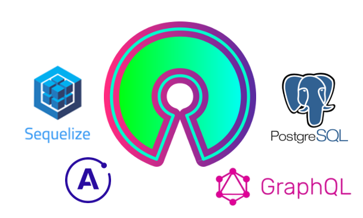

------------

# Gracias por ser tan Open Source!!

## Short & strong backend : Secualize GraphQL, Apollo, PostgreSQL

## Full reactive frontend Svelte(Sapper/Rollup)

## Getting Started!!

`1. git clone https://github.com/resourceldg/full.git`

 - ### Backend install & local run

`2. cd full/backend`

`3. npm i` 

`4. npm start`

 - ### Frontend Getting Started!!

`5. cd full/frontend`

`6. npm i` 

`7. npm run dev`

- ## Next Releases! :soon:

`Tree Directories`

`Docker image`

- ## Social interaction :blue_heart:

**Telegram Groups or Slack**

 :octocat: 

 [link to Telegram!](https://t.me/joinchat/O8TIUByKHkYnpRRsIYj8OA)
 
 [link to Slack!](https://join.slack.com/t/resourceldg/shared_invite/zt-fxvzg4dt-X_7mGIznpef9j7Zatyzarw)
